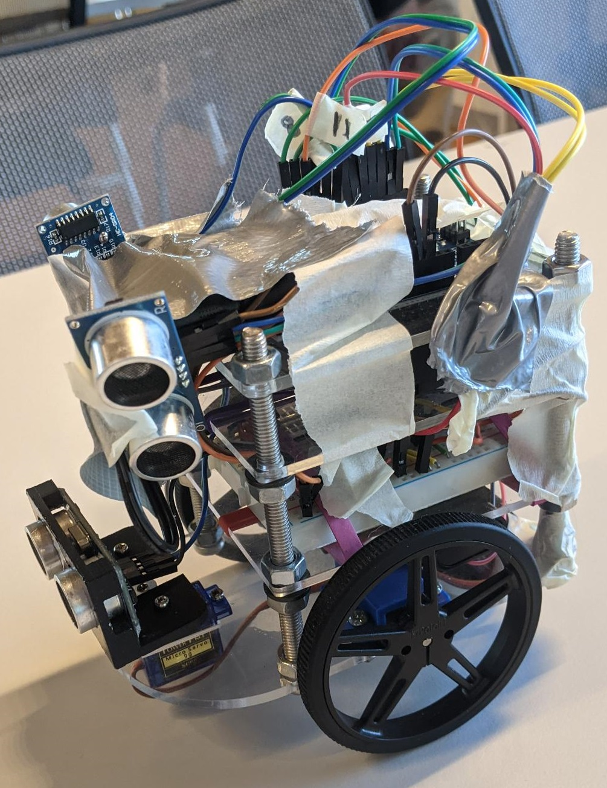

<!--
*** Based on the Best-README-Template: https://github.com/othneildrew/Best-README-Template
***
*** To avoid retyping too much info. Do a search and replace for the following:
*** repo_name, project_title, project_description
-->

<!-- PROJECT SHIELDS -->
<!-- [![Release][release-shield]][release-url] -->
<!-- [![Last Commit][last-commit-shield]][last-commit-url] -->
<!-- [![Contributors][contributors-shield]][contributors-url] -->
<!-- [![Forks][forks-shield]][forks-url] -->
<!-- [![Stargazers][stars-shield]][stars-url] -->
<!-- [![Issues][issues-shield]][issues-url] -->
<!-- [![MIT License][license-shield]][license-url] -->
<!-- [![LinkedIn][linkedin-shield]][linkedin-url] -->

<!-- PROJECT LOGO -->
 

<!--    -->

  <h2 align="center">Arduino Autonomous Rover</h2>

  

    Arduino program for a rover with autonomous navigation.
     
    This project was created during my university studies at <b>ANU</b> in <b>2021</b> and has been transferred from the ANU GitLab server.
     
    <b>Group project</b> - see <a href="#acknowledgements">Acknowledgements</a> and code comments for attributions.
     
<!--     <a href="https://github.com/Tim-W-James/repo_name"><strong>Explore the docs »</strong></a>
      
      -->
<!--     ·
    <a href="https://github.com/Tim-W-James/repo_name/issues">Report Bug</a> -->
    <a href="https://www.tinkercad.com/things/gk0MvQ7Jkc8">View Simulation</a>
<!--     ·
    <a href="https://github.com/Tim-W-James/repo_name/issues">Request Feature</a> -->
  

<!-- TABLE OF CONTENTS -->

  
Table of Contents

  <ol>
    <li>
      <a href="#about-the-project">About The Project</a>
      <ul>
        <li><a href="#features">Features</a></li>
        <li><a href="#built-with">Built With</a></li>
      </ul>
    </li>
    <li>
      <a href="#usage">Usage</a>
      <ul>
        <li><a href="#prerequisites">Prerequisites</a></li>
        <li><a href="#installation">Installation</a></li>
        <li><a href="#development">Development</a></li>
      </ul> 
    </li>
<!--     <li><a href="#roadmap">Roadmap</a></li> -->
<!--     <li><a href="#contributing">Contributing</a></li> -->
<!--     <li><a href="#license">License</a></li> -->
    <li><a href="#contact">Contact</a></li>
    <li>
      <a href="#acknowledgements">Acknowledgements</a>
      <ul>
        <li><a href="#group-members">Group members</a></li>
      </ul> 
    </li>
  </ol>

<!-- ABOUT THE PROJECT -->
## About The Project

We created a rover that sucessfully navigated a maze autonomously. This repo contains the Arduino code and sensor data. Find a simulation of the project on [TinkerCAD](https://www.tinkercad.com/things/gk0MvQ7Jkc8). My primary contribution was creating the C++ code for motors/sensors and navigation logic.

### Features

* Motor control including turning on the spot and reverse
* Obstacle aviodance via ultrasonic sensors and servo
* Detection of angled walls with servo where ultrasonic waves would otherwise be reflected
* Dead-end detection
* Auto correction if the rover strafes
* Compact chassis

### Built With

* Arduino
* TinkerCAD
* Breadboard circuit

<!-- GETTING STARTED -->
## Usage

### Prerequisites

* Obtain an Arduino Uno
* Obtain parts as in the [TinkerCAD](https://www.tinkercad.com/things/gk0MvQ7Jkc8) simulation

### Installation

* Connect the circuit as in the diagram above
* Set the `mode` you want to use at the top of the [rover.py](https://github.com/Tim-W-James/Arduino-Autonomous-Rover/blob/master/rover/rover.ino) file.
   - 0 - autonomous navigation
   - 1 - straight line and reverse
   - 2 - square path
* Compile and upload to your Arduino Uno

### Development

Use the Arduino IDE.

<!-- CONTACT -->
## Contact

Email: [tim.jameswork9800@gmail.com](mailto:tim.jameswork9800@gmail.com "tim.jameswork9800@gmail.com")

Project Link: [https://github.com/Tim-W-James/Arduino-Autonomous-Rover](https://github.com/Tim-W-James/Arduino-Autonomous-Rover)

<!-- ACKNOWLEDGEMENTS -->
## Acknowledgements

### Group members:

* Clare Heaney
* Kaveesha Jayaweera
* Ellie-Mae Broomhead

[product-screenshot]: images/screenshot.png

<!-- USEFUL LINKS FOR MARKDOWN
* https://www.markdownguide.org/basic-syntax
* https://www.webpagefx.com/tools/emoji-cheat-sheet
* https://shields.io
* https://choosealicense.com
* https://pages.github.com
* https://daneden.github.io/animate.css
* https://connoratherton.com/loaders
* https://kenwheeler.github.io/slick
* https://github.com/cferdinandi/smooth-scroll
* http://leafo.net/sticky-kit
* http://jvectormap.com
* https://fontawesome.com -->
